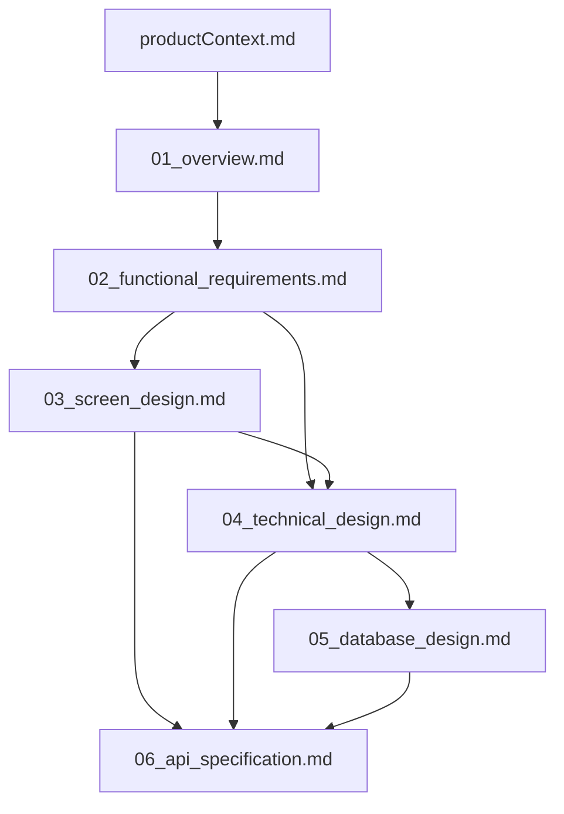

# Active Context

## Current work focus
- API Specification (`06_api_specification.md`) completed.

## Recent changes
- Created the technical design (`04_technical_design.md`).
- Updated `systemPatterns.md` and `techContext.md` with the selected technology stack.
- Agreed on a full-stack architecture using Next.js, Prisma, and NextAuth.js.
- Completed API Specification (`06_api_specification.md`).

## Next steps
- **[Next]** Resume the setup of the Next.js project in the `buam` directory.

## Active decisions and considerations
- A top-down design process has been adopted.

### Agreed Design Process
The project will follow these design steps in order:

1.  **Project Overview Definition (`01_overview.md`)**
2.  **Functional Requirements Definition (`02_functional_requirements.md`)**
3.  **Screen & UI/UX Design (`03_screen_design.md`)**
4.  **Technical Design (`04_technical_design.md`)**
5.  **Database Design (`05_database_design.md`)**
6.  **API Specification (`06_api_specification.md`)**

### Deliverable Dependencies

## Important patterns and preferences
- Design will be conducted from upstream processes (user needs, use cases) to downstream processes (detailed specifications).

## Learnings and project insights
- N/A
