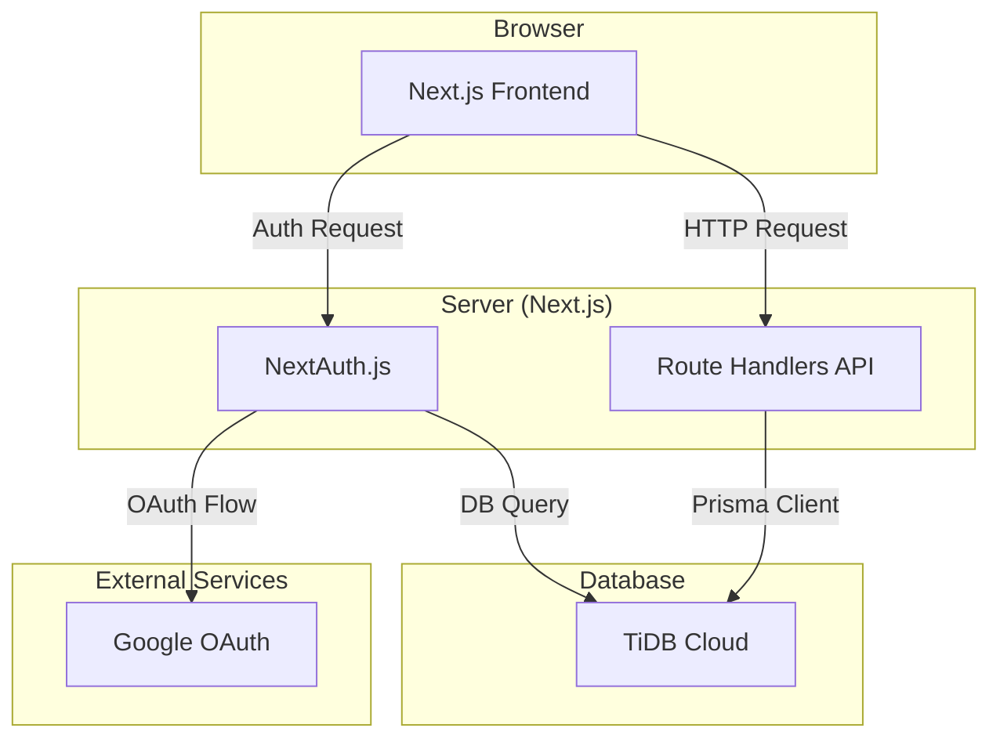

# System Patterns

## System architecture
- **Full-stack Framework**: The system is built on a full-stack Next.js application.
- **Rendering Strategy**: Primarily uses Client-Side Rendering (CSR) with Next.js App Router. Client Components (`"use client"`) are the default for UI.
- **API Layer**: A RESTful API is implemented using Next.js Route Handlers.
- **Infrastructure**:
    - **Development**: Docker Compose is used to create a consistent local development environment.
    - **Production**: Designed with deployment to Vercel or AWS in mind.

## Key technical decisions
- **Unified Language**: TypeScript is used for both frontend and backend, ensuring type safety across the stack.
- **ORM for Database Access**: Prisma is adopted for type-safe database interactions and streamlined migrations.
- **Component-based UI**: The user interface is built with React, following a component-based architecture.

## Design patterns in use
- **Provider Pattern**: NextAuth.js session provider wraps the application to manage authentication state.
- **Utility-First CSS**: Tailwind CSS is used for styling, promoting reusability and rapid UI development.

## Component relationships

## Critical implementation paths
- **Authentication**: Implementing both Google OAuth and Credentials-based authentication using NextAuth.js is a critical first step.
- **Database Schema**: Defining a robust schema in Prisma that supports all functional requirements.
- **Core Feature - Mileage Logging**: The UI and API for logging daily mileage must be highly optimized for performance and usability.
