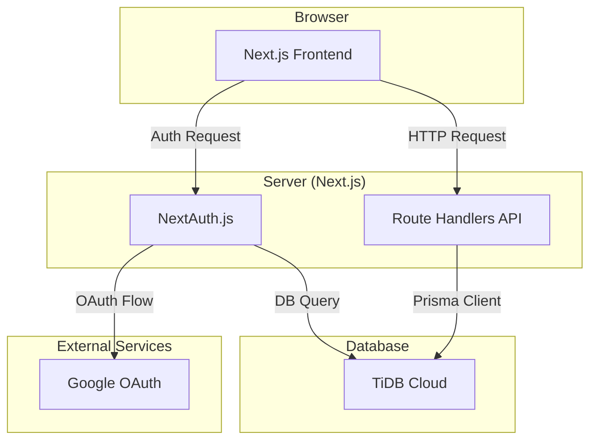

> [!CAUTION]
> This project is currently under development. Features are not fully implemented.

# Business Use Allocation Meter - BUAM

## Project Overview

"BUAM" is an application designed to simplify expense calculation for sole proprietors in Japan, especially for expenses including household apportionment, and to significantly reduce the burden of tax filing. It aims to reduce the time and effort involved in manual expense recording and calculation, prevent errors in household apportionment calculations, and eliminate the hassle and risk of losing paper-based records.

## Core Features (Initial Release)

The initial release will provide features for managing automobile-related expenses.

-   **Mileage Data Entry**: Users can record daily cumulative odometer readings and the purpose of use for the day (business/personal). Daily mileage is automatically calculated from the difference with the previous reading.
-   **Business Use Ratio Display**: The application automatically calculates and displays the current business use ratio based on recorded data.
-   **Mileage History Viewing/Editing**: Users can view a list of past mileage records and edit or delete them as needed.
-   **Data Export**: Mileage history data can be exported in CSV format for tax filing purposes.
-   **User Management**: Admin users can invite/create new users and view a list of registered users.
-   **Authentication**: Authentication via email and password, or social login (e.g., Google).

## User Experience Goals

-   A simple and intuitive interface where daily input tasks can be completed in a few taps.
-   A dashboard that provides an at-a-glance view of essential information (e.g., business use ratio).
-   The ability to easily export data required for tax filing.

## Future Outlook

While the initial release focuses on automobile-related expenses, future enhancements are planned:

-   Expansion to other expense categories (e.g., rent, utilities, communication costs)
-   Receipt OCR function

## Technology Stack

-   **Framework**: Next.js 15+ (App Router)
-   **Language**: TypeScript
-   **UI Library**: React
-   **Styling**: Tailwind CSS
-   **Database**: TiDB Cloud (MySQL compatible)
-   **ORM**: Prisma
-   **Authentication**: NextAuth.js
-   **Testing**: Jest, React Testing Library, Playwright

## System Architecture

-   **Full-stack Framework**: A full-stack configuration using Next.js (App Router).
-   **Rendering Strategy**: Primarily Client-Side Rendering (CSR), with `"use client"` applied to each screen component.
-   **API Layer**: RESTful API built using Next.js Route Handlers.
-   **Infrastructure**:
    -   **Development Environment**: Local development environment using Docker Compose.
    -   **Production Environment**: Designed for deployment to Vercel or AWS.

### Component Relationship Diagram

## Development Setup

-   **Package Manager**: npm
-   **Local Environment**: Docker Compose
-   **Version Control**: Git

### Database Design

Database models are defined using Prisma schema (`buam/prisma/schema.prisma`). Key models include `User`, `Account`, `Session`, `Vehicle`, and `MileageLog`.

### Authentication Flow

NextAuth.js is used to support Google social login and password authentication. Upon successful authentication, a JWT is issued and must be included in the Authorization header for subsequent API requests.
