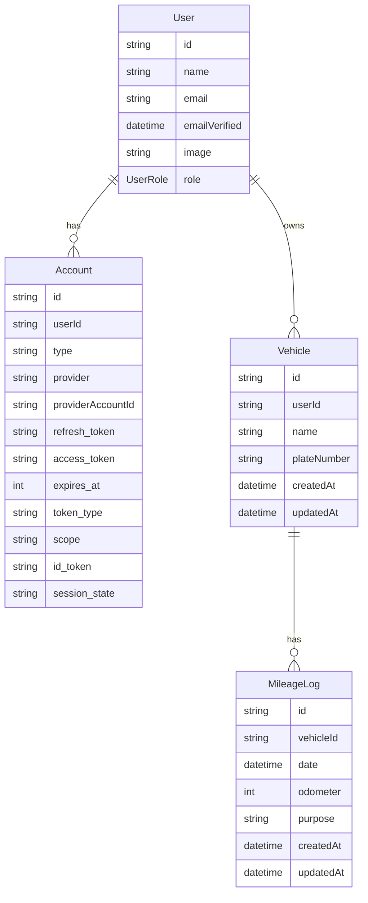

# 5. データベース設計

本ドキュメントは、Prismaスキーマを用いてデータベースの構造を定義する。

## 5.1. ER図

## 5.2. モデル定義

### 5.2.1. `UserRole` Enum

ユーザーの役割を定義する。

| 値 | 説明 |
| :--- | :--- |
| `ADMIN` | 管理者 |
| `USER` | 一般ユーザー |

### 5.2.2. `User` モデル

ユーザー情報を格納する。NextAuth.jsの`AdapterUser`に準拠しつつ、アプリケーションで必要な情報を追加する。

| フィールド名 | 型 | 説明 |
| :--- | :--- | :--- |
| `id` | `String` | ユーザーID (主キー, CUID) |
| `name` | `String?` | ユーザー名 |
| `email` | `String?` | メールアドレス (ユニーク) |
| `emailVerified` | `DateTime?` | メールアドレス検証日時 |
| `image` | `String?` | プロフィール画像URL |
| `role` | `UserRole` | ユーザーの役割。デフォルトは `USER`。 |
| `accounts` | `Account[]` | 関連するアカウント情報 |
| `vehicles` | `Vehicle[]` | 所有する車両情報 |
| `createdAt` | `DateTime` | 作成日時 |
| `updatedAt` | `DateTime` | 更新日時 |

### 5.2.3. `Account` モデル

NextAuth.jsがソーシャルログイン等のアカウント情報を管理するために使用する。

| フィールド名 | 型 | 説明 |
| :--- | :--- | :--- |
| `id` | `String` | アカウントID (主キー, CUID) |
| `userId` | `String` | ユーザーID (外部キー) |
| `type` | `String` | アカウント種別 (e.g., "oauth", "email") |
| `provider` | `String` | プロバイダー名 (e.g., "google", "credentials") |
| `providerAccountId` | `String` | プロバイダーにおけるアカウントID |
| `user` | `User` | 関連するユーザー |

### 5.2.4. `Vehicle` モデル

ユーザーが登録した車両の情報を格納する。

| フィールド名 | 型 | 説明 |
| :--- | :--- | :--- |
| `id` | `String` | 車両ID (主キー, CUID) |
| `userId` | `String` | 所有者のユーザーID (外部キー) |
| `name` | `String` | 車両名 (例: "プリウス", "社用車A") |
| `plateNumber` | `String?` | ナンバープレート情報 (任意) |
| `user` | `User` | 関連するユーザー |
| `mileageLogs` | `MileageLog[]` | この車両に関連する走行記録 |
| `createdAt` | `DateTime` | 作成日時 |
| `updatedAt` | `DateTime` | 更新日時 |

### 5.2.5. `MileageLog` モデル

日々のメーター値を記録する。日々の走行距離は、前回の記録との差分で算出する。

| フィールド名 | 型 | 説明 |
| :--- | :--- | :--- |
| `id` | `String` | 走行記録ID (主キー, CUID) |
| `vehicleId` | `String` | 車両ID (外部キー) |
| `date` | `DateTime` | 記録日 |
| `odometer` | `Int` | その日時点の累積走行距離メーターの値 (km)。最大300,000kmまでを想定。 |
| `purpose` | `String` | その日の主な目的 ("BUSINESS", "PERSONAL", "MIXED") |
| `vehicle` | `Vehicle` | 関連する車両 |
| `createdAt` | `DateTime` | 作成日時 |
| `updatedAt` | `DateTime` | 更新日時 |
